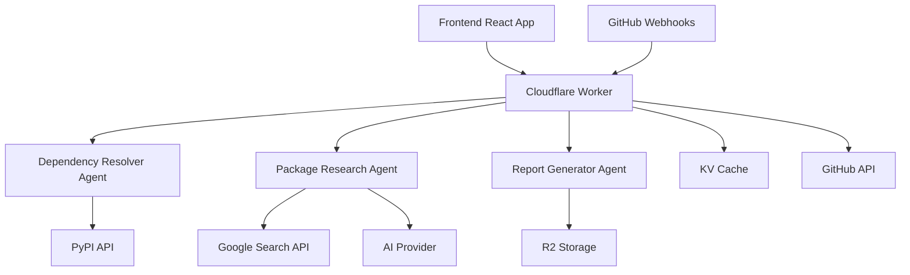

# Python Dependency Resolver

An AI-powered Python dependency resolution system built with Cloudflare Workers and specialized AI agents. This system intelligently resolves Python package dependencies while detecting deprecated packages, suggesting alternatives, and handling version conflicts.

<div align="center">

[](https://opensource.org/licenses/MIT)
[](https://www.typescriptlang.org/)
[](https://workers.cloudflare.com/)
[](https://reactjs.org/)

**[🚀 Live Demo](https://python-dependency-resolver.bugzer.workers.dev)** • **[📚 Documentation](./docs/)** • **[🐙 GitHub Integration](./docs/GITHUB_INTEGRATION.md)**

</div>

## ✨ Features

### 🧠 AI-Powered Analysis
- **Intelligent Resolution**: Uses specialized AI agents for complex dependency resolution
- **Deprecation Detection**: Automatically identifies deprecated packages and suggests modern alternatives
- **Conflict Resolution**: Handles version conflicts with intelligent recommendations
- **Security Analysis**: Identifies known vulnerabilities and maintenance status

### 🔗 GitHub Integration
- **Automated PR Analysis**: Get AI-powered dependency analysis comments on every pull request
- **Status Checks**: Block deployments with critical dependency conflicts
- **Real-time Notifications**: Instant feedback on deprecated packages and conflicts
- **Zero Configuration**: Install the GitHub App once, works across all your repositories

### 🏗️ Modern Architecture
- **Edge Computing**: Runs on Cloudflare's global edge network for fast response times
- **Multi-Agent System**: Specialized AI agents working together for different aspects of resolution
- **Intelligent Caching**: KV storage for package information and R2 for reports
- **Real-time UI**: React/TypeScript interface with live updates

## 🚀 Quick Start

### For Developers

```bash
# Clone and setup
git clone https://github.com/your-org/agents-starter.git
cd agents-starter
npm install

# Configure environment
cp .dev.vars.example .dev.vars
# Edit .dev.vars with your API keys

# Start development server
npm start
```

### For API Users

```bash
# Basic dependency resolution
curl -X POST https://python-dependency-resolver.bugzer.workers.dev/agents/dependency-resolver-agent/resolve \
  -H "Content-Type: application/json" \
  -d '{
    "requirements": [
      {"name": "requests", "operator": ">=", "version": "2.25.0", "original_spec": "requests>=2.25.0"}
    ],
    "python_version": "3.9"
  }'
```

### For Teams (GitHub Integration)

1. **Install GitHub App**: Visit our [GitHub App page](https://github.com/apps/python-dependency-analyzer)
2. **Configure Repositories**: Select which repos to analyze
3. **Automatic Analysis**: PRs with `requirements.txt` changes get automatic analysis

## 📖 Documentation

Our comprehensive documentation covers all aspects of the system:

| Guide | Description | Audience |
|-------|-------------|----------|
| **[📚 Documentation Index](./docs/README.md)** | Complete documentation overview | All Users |
| **[🔧 Development Guide](./docs/DEVELOPMENT.md)** | Setup, testing, and contribution guide | Developers |
| **[📋 API Reference](./docs/API.md)** | Complete API documentation with examples | API Users |
| **[🚀 Deployment Guide](./docs/DEPLOYMENT.md)** | Production deployment and infrastructure | DevOps |
| **[🎨 Components](./docs/COMPONENTS.md)** | React component library documentation | Frontend Devs |
| **[🐙 GitHub Integration](./docs/GITHUB_INTEGRATION.md)** | GitHub App setup and configuration | Teams |

## 🏗️ Architecture



### System Components

- **🤖 AI Agents**: Specialized agents for dependency resolution, package research, and report generation
- **⚡ Cloudflare Workers**: Edge computing runtime for global performance
- **🎨 React Frontend**: Modern TypeScript interface with Tailwind CSS
- **💾 Smart Caching**: KV for package data, R2 for reports
- **🔗 Integrations**: GitHub, PyPI, Google Search, AI providers

## 🛠️ Technology Stack

**Backend**
- Cloudflare Workers (V8 isolates)
- TypeScript + Durable Objects
- Vercel AI SDK (OpenAI/Azure OpenAI)
- Cloudflare KV + R2 Storage

**Frontend**
- React 19 + TypeScript
- Tailwind CSS v4
- Vite + Vitest
- Radix UI + GSAP

**DevOps**
- Wrangler CLI
- GitHub Actions
- Biome + Prettier

## 📋 Usage Examples

### Web Interface

1. **Visit the app**: [python-dependency-resolver.bugzer.workers.dev](https://python-dependency-resolver.bugzer.workers.dev)
2. **Enter requirements**: Paste your Python requirements
3. **Configure options**: Set Python version, preferences
4. **Get results**: View analysis, requirements.txt, and detailed reports

### API Integration

```typescript
// Resolve dependencies
const response = await fetch('/agents/dependency-resolver-agent/resolve', {
  method: 'POST',
  headers: { 'Content-Type': 'application/json' },
  body: JSON.stringify({
    requirements: [
      { name: 'django', operator: '>=', version: '4.0', original_spec: 'django>=4.0' }
    ],
    python_version: '3.11',
    exclude_deprecated: true
  })
});

const { id, status } = await response.json();

// Check status
const statusResponse = await fetch(`/agents/dependency-resolver-agent/status?id=${id}`);
const result = await statusResponse.json();
```

### GitHub Integration

Once installed, the GitHub App automatically:

- 🔍 **Analyzes** `requirements.txt` changes in PRs
- 💬 **Comments** with detailed dependency analysis
- ✅ **Status checks** for CI/CD integration
- 🚨 **Alerts** on deprecated or vulnerable packages

## 🔧 Development

### Prerequisites

- Node.js 18+
- Cloudflare account with Workers plan
- OpenAI or Azure OpenAI API key

### Local Development

```bash
# Install dependencies
npm install

# Start development server (includes hot reloading)
npm start

# Run tests
npm test

# Deploy to development
npm run deploy:dev
```

### Project Structure

```
agents-starter/
├── src/
│   ├── agents/          # Durable Object agents
│   ├── components/      # React UI components  
│   ├── services/        # Business logic
│   ├── app.tsx         # Main React app
│   └── server.ts       # Worker entry point
├── docs/               # Comprehensive documentation
├── examples/           # Usage examples
├── scripts/            # Setup scripts
└── tests/              # Test files
```

## 🧪 Testing

```bash
# Run all tests
npm test

# Run with coverage
npm run test:coverage

# Run specific test
npm test -- dependency-resolver.test.ts

# Watch mode
npm run test:watch
```

## 🚀 Deployment

### Production Deployment

```bash
# Deploy to production
npm run deploy

# Deploy with custom environment
CLOUDFLARE_ENVIRONMENT=production npm run deploy
```

### Environment Setup

1. **Configure Cloudflare resources** (KV, R2, Durable Objects)
2. **Set secrets** for API keys
3. **Verify deployment** with health checks

See the [Deployment Guide](./docs/DEPLOYMENT.md) for detailed instructions.

## 🔗 GitHub Integration Setup

### Quick Setup

```bash
# Run the setup script
chmod +x scripts/setup-github-integration.sh
./scripts/setup-github-integration.sh
```

### Manual Setup

1. **Create GitHub App** with repository permissions
2. **Configure webhook** endpoint
3. **Install on repositories** you want to analyze
4. **Set secrets** in Cloudflare Worker

See the [GitHub Integration Guide](./docs/GITHUB_INTEGRATION.md) for complete setup.

## 📊 Example Analysis

### Input
```
django>=4.0
requests>=2.25.0
fabric==1.14.0
numpy
```

### Output
- ✅ **django>=4.0**: Current, well-maintained
- ✅ **requests>=2.25.0**: Security update available (→ 2.28.1)
- ⚠️ **fabric==1.14.0**: **DEPRECATED** → Use `fabric2` or `invoke`
- ✅ **numpy**: Latest version resolved (1.24.3)

### Generated Requirements
```txt
# Generated by Python Dependency Analyzer
# Python 3.11 compatible
# Generated on 2024-01-15

django==4.2.7
requests==2.28.1
# fabric==1.14.0  # DEPRECATED - consider fabric2 or invoke
numpy==1.24.3
```

## 🤝 Contributing

We welcome contributions! Please see our [Development Guide](./docs/DEVELOPMENT.md) for:

- **Setup instructions**
- **Coding standards**
- **Testing guidelines**
- **Pull request process**

### Quick Contribution Steps

1. **Fork** the repository
2. **Create** a feature branch (`git checkout -b feature/amazing-feature`)
3. **Commit** changes (`git commit -m 'Add amazing feature'`)
4. **Push** to branch (`git push origin feature/amazing-feature`)
5. **Open** a Pull Request

## 📄 License

This project is licensed under the MIT License - see the [LICENSE](LICENSE) file for details.

## 🆘 Support

- **📚 Documentation**: [Complete guides](./docs/)
- **🐛 Issues**: [GitHub Issues](https://github.com/your-org/agents-starter/issues)
- **💬 Discussions**: [GitHub Discussions](https://github.com/your-org/agents-starter/discussions)
- **📧 Contact**: [maintainers@example.com](mailto:maintainers@example.com)

## 🌟 Acknowledgments

- **Cloudflare Workers** for edge computing platform
- **Vercel AI SDK** for AI integration
- **PyPI** for package information
- **React + TypeScript** for modern web development

---

<div align="center">

**Built with ❤️ using Cloudflare Workers, AI, and modern web technologies**

[🚀 Try it now](https://python-dependency-resolver.bugzer.workers.dev) • [📚 Read the docs](./docs/) • [⭐ Star on GitHub](https://github.com/your-org/agents-starter)

</div>
