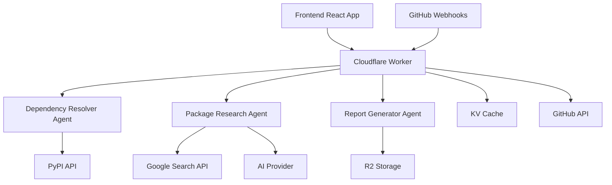

# Documentation Index

Welcome to the Python Dependency Resolver documentation! This directory contains comprehensive guides for developers, users, and contributors.

## 📚 Documentation Overview

This documentation covers all aspects of the Python Dependency Resolver system - an AI-powered dependency resolution service built on Cloudflare Workers with specialized agents for intelligent package analysis.

## 🗂️ Documentation Structure

### Core Documentation

| Document | Description | Audience |
|----------|-------------|----------|
| **[Development Guide](./DEVELOPMENT.md)** | Complete development setup, testing, and contribution guide | Developers |
| **[API Reference](./API.md)** | Comprehensive API documentation with examples | Developers, Integrators |
| **[Deployment Guide](./DEPLOYMENT.md)** | Production deployment and infrastructure setup | DevOps, Developers |
| **[Component Documentation](./COMPONENTS.md)** | React component library and UI patterns | Frontend Developers |
| **[GitHub Integration](./GITHUB_INTEGRATION.md)** | GitHub App setup and webhook configuration | DevOps, Team Leads |

### Quick Links

- **🚀 Getting Started**: [Development Guide → Getting Started](./DEVELOPMENT.md#getting-started)
- **📋 API Usage**: [API Reference → Usage Examples](./API.md#usage-examples)
- **🔧 Deployment**: [Deployment Guide → Production Deployment](./DEPLOYMENT.md#production-deployment)
- **🐙 GitHub Setup**: [GitHub Integration → Setup Process](./GITHUB_INTEGRATION.md#setup-process)
- **🎨 UI Components**: [Component Docs → UI Components](./COMPONENTS.md#ui-components)

## 🎯 Getting Started

### For New Developers

1. **Start Here**: [Development Guide](./DEVELOPMENT.md)
   - Environment setup
   - Local development
   - Testing strategies

2. **Understand the API**: [API Reference](./API.md)
   - Core endpoints
   - Data schemas
   - Authentication

3. **Learn the Components**: [Component Documentation](./COMPONENTS.md)
   - UI component library
   - Design patterns
   - Styling guidelines

### For DevOps/Infrastructure

1. **Deployment Setup**: [Deployment Guide](./DEPLOYMENT.md)
   - Cloudflare configuration
   - Environment management
   - Monitoring setup

2. **GitHub Integration**: [GitHub Integration Guide](./GITHUB_INTEGRATION.md)
   - GitHub App creation
   - Webhook configuration
   - Security setup

### For API Users

1. **API Overview**: [API Reference](./API.md)
   - Authentication
   - Core endpoints
   - Error handling

2. **Usage Examples**: [API Reference → Examples](./API.md#usage-examples)
   - Basic dependency resolution
   - Package research
   - Status checking

## 🏗️ System Architecture

### High-Level Overview



### Key Components

- **Frontend**: React/TypeScript SPA with Tailwind CSS
- **Backend**: Cloudflare Workers with Durable Objects
- **Agents**: Specialized AI agents for different tasks
- **Storage**: KV for caching, R2 for reports
- **Integrations**: GitHub, PyPI, Google Search, AI providers

## 🚀 Core Features

### Dependency Resolution
- AI-powered version resolution
- Conflict detection and resolution
- Python version compatibility checking
- Security vulnerability scanning

### GitHub Integration
- Automated PR analysis
- Dependency change detection
- Intelligent commenting
- Status check integration

### Package Analysis
- Deprecation detection
- Alternative package suggestions
- Maintenance status checking
- Security advisory integration

### Report Generation
- Detailed analysis reports
- Clean requirements.txt generation
- Export in multiple formats
- Historical tracking

## 🛠️ Technology Stack

### Backend Technologies
- **Runtime**: Cloudflare Workers (V8 isolates)
- **Language**: TypeScript
- **Framework**: Custom agent system with Durable Objects
- **AI**: Vercel AI SDK with OpenAI/Azure OpenAI
- **Storage**: Cloudflare KV + R2
- **APIs**: PyPI, GitHub, Google Search

### Frontend Technologies
- **Framework**: React 19 with TypeScript
- **Styling**: Tailwind CSS v4
- **Build**: Vite with TypeScript
- **Components**: Radix UI primitives
- **Animations**: GSAP
- **Markdown**: React Markdown with GFM

### Development Tools
- **Package Manager**: npm
- **Linting**: Biome
- **Formatting**: Prettier
- **Testing**: Vitest with Cloudflare Workers pool
- **Deployment**: Wrangler CLI

## 📖 Documentation Guidelines

### Writing Style

- **Clear and Concise**: Use simple, direct language
- **Code Examples**: Include working code examples
- **Visual Aids**: Use diagrams and screenshots where helpful
- **Progressive Disclosure**: Start simple, add complexity gradually

### Documentation Standards

- **Markdown Format**: All docs in GitHub Flavored Markdown
- **Consistent Structure**: Use standard headings and formatting
- **Cross-References**: Link between related documents
- **Code Highlighting**: Use appropriate syntax highlighting

### Contributing to Documentation

See the [Development Guide → Contributing](./DEVELOPMENT.md#contributing-guidelines) for:
- Documentation standards
- Review process
- Style guidelines
- Update procedures

## 🔧 Common Tasks

### Development Setup
```bash
git clone <repository>
cd agents-starter
npm install
cp .dev.vars.example .dev.vars
# Edit .dev.vars with your API keys
npm start
```

### Running Tests
```bash
npm test                    # Run all tests
npm run test:watch         # Watch mode
npm run test:coverage      # With coverage
```

### Deployment
```bash
npm run deploy:dev         # Development
npm run deploy            # Production
```

### API Testing
```bash
# Health check
curl https://your-worker.workers.dev/health

# Dependency resolution
curl -X POST https://your-worker.workers.dev/agents/dependency-resolver-agent/resolve \
  -H "Content-Type: application/json" \
  -d '{"requirements":[{"name":"requests","operator":"","version":"","original_spec":"requests"}]}'
```

## 🐛 Troubleshooting

### Common Issues

| Issue | Solution | Reference |
|-------|----------|-----------|
| API keys not working | Check secret configuration | [Deployment Guide](./DEPLOYMENT.md#configure-secrets) |
| GitHub webhook not received | Verify webhook URL and secrets | [GitHub Integration](./GITHUB_INTEGRATION.md#troubleshooting) |
| Components not rendering | Check TypeScript errors | [Component Docs](./COMPONENTS.md#component-testing) |
| Deployment failing | Verify Cloudflare bindings | [Deployment Guide](./DEPLOYMENT.md#troubleshooting) |

### Getting Help

1. **Check Documentation**: Search these docs first
2. **GitHub Issues**: Check existing issues or create new ones
3. **Discussions**: Use GitHub Discussions for questions
4. **Support**: Contact maintainers for urgent issues

## 📚 External Resources

### Cloudflare Workers
- [Workers Documentation](https://developers.cloudflare.com/workers/)
- [Durable Objects Guide](https://developers.cloudflare.com/workers/runtime-apis/durable-objects/)
- [KV Storage](https://developers.cloudflare.com/workers/runtime-apis/kv/)
- [R2 Storage](https://developers.cloudflare.com/r2/)

### Frontend Development
- [React Documentation](https://react.dev/)
- [TypeScript Handbook](https://www.typescriptlang.org/docs/)
- [Tailwind CSS](https://tailwindcss.com/docs)
- [Vite Guide](https://vitejs.dev/guide/)

### AI Integration
- [Vercel AI SDK](https://sdk.vercel.ai/docs)
- [OpenAI API](https://platform.openai.com/docs)
- [Azure OpenAI](https://docs.microsoft.com/en-us/azure/cognitive-services/openai/)

### GitHub Integration
- [GitHub Apps](https://docs.github.com/en/developers/apps)
- [Webhooks](https://docs.github.com/en/developers/webhooks-and-events/webhooks)
- [GitHub API](https://docs.github.com/en/rest)

## 🔄 Documentation Updates

This documentation is actively maintained. For the latest updates:

- **Check Git History**: See recent changes to documentation files
- **Watch Repository**: Get notifications for documentation updates
- **Contribute**: Help keep documentation current and accurate

---

**Last Updated**: January 2024  
**Version**: 1.0.0  
**Maintainers**: Development Team

For questions or suggestions about this documentation, please open an issue or discussion in the repository. 